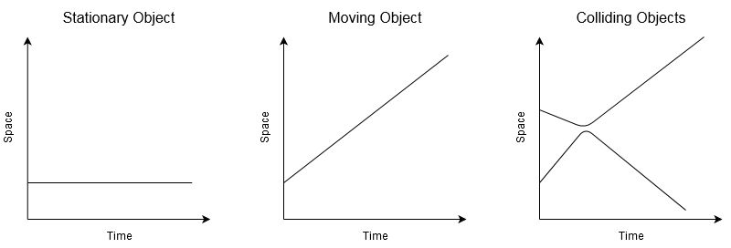

# Space-Time Diagrams

Visualising events and processes over time

I wanted a clear way to visualise events over time when talking about how we do digital preservation.  As my background is in physics, I wondered whether a simple version of a space-time diagram would work.

While these diagrams are mostly used in [relativity](https://en.wikipedia.org/wiki/Minkowski_diagram) and [quantum mechanics](https://en.wikipedia.org/wiki/Feynman_diagram), they can also be used to visualise simple physical systems, as shown below:

As you can see, if an object is not moving, then it traces our a simple line parallel with the time axes.  If the object is moving through space, then the line runs at an angle -- the steeper the line, the faster the object is moving. If you plot two objects colliding, then the lines converge until the two objects start to bounce off each other. The lines then curve away until the two objects are heading in opposite directions.

While the events in the history of a digital archive behave very differently, a space-time diagram still provide a useful way of visualising what's going on.

See {doc}`/patterns/contexts/index` for examples.