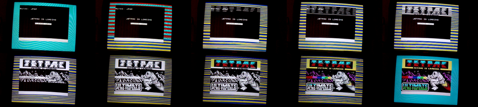

<!-- MarkdownTOC autolink="true" -->

- [Introduction](#introduction)
- [Digital Objects](#digital-objects)
- [Unsafe Device Removal](#unsafe-device-removal)
- [Loading...](#loading)
- [Understanding the experiment](#understanding-the-experiment)
- [Glitches & Polyglots](#glitches--polyglots)
- [It starts with Save As...](#it-starts-with-save-as)
- [Formats](#formats)
- [The Parse & The Play](#the-parse--the-play)

<!-- /MarkdownTOC -->

## Introduction

To preserve our digital resources, we need to understand how they work.

## Digital Objects

But it is common to talk about 'preserving digital objects', such as [Preserving digital Objects with Restricted Resources][9], [Preserving Complex Digital Objects][10] or [Preserving the Authenticity of Contingent Digital Objects][11] (although oddly, the [DPC perservation handbook does not define it][12]).  In this context, the term 'digital object' is *mostly* used to refer to bitstream (or bitstreams), at least among those of us working in the shadow of OAIS. But it's also use to refer to other layers of representation, right up to 'the thing I interact with' (e.g. see [A Theory Of Digital Objects][5]). 

But surely the latter is closer to what we really mean to preserve? Who cares what the encoding is, as long as the text remains unchanged? If we place the emphasis of preservation upon the bitstream, don't we risk losing sight of the fact that it is the *experience* of access that we are trying to preserve?

This confusion peaks when it comes to defining the 'significant properties' of these objects, and in the worst cases, lead to property models built on a mish-mash of bitstream properties and properties observed during use.

What do we mean by 'digital object'? 

Well, the *official* answer is clear enough:

>
> Digital Object: An object composed of a set of bit sequences. 
>
>  <small class="d-block text-right">[Reference Model for an Open Archival Information System (OAIS)][1]</small>

Other treatments have attempted to draw more attention to the layers of interpretation around bitstreams -- to the software. For example, [Kenneth Thibodeau's tripartite model][3] teases the digital object into physical, logical and conceptual layers.  The team behind [BitCurator][7] tease the notion of a digital object into even more layers:

>
> 
>
>  The various levels of representation in what we consider to be digital objects @BitCurator @openpreserve
>
>  <small class="d-block text-right">[@digitalfay][6]</small>

Thinking along similar lines to Thibodeau, Matthew Kirschenbaum argues as follows:

>
> "Here I want to go a step further and suggest that the preservation of digital objects is logically inseparable from the act of their creation — the lag between creation and preservation collapses completely, since a digital object may only ever be said to be preserved if it is accessible, and each individual access creates the object anew. One can, in a very literal sense, never access the "same" electronic file twice, since each and every access constitutes a distinct instance of the file that will be addressed and stored in a unique location in computer memory."
>
>  <small class="d-block text-right">[Matthew Kirschenbaum](https://twitter.com/mkirschenbaum), [The .txtual Condition][4]</small>

All the approaches outlined here share a common assumption -- that the bitstream is fundamental. But by the end of the first sentence from Kirshenbaum, the digital object is *also* the thing created anew inside the memory of the machine. At once, both the bitstream *and* something approaching Thibodeau's 'logical object'.

Kirshenbaum's perpertual re-creation is much closer to the National Archives of Australia's [performance model][8], which avoids the term 'digital object' altogether. Rather, it describes the digital record as a something performed by a process, built from a source.

> ???
>
>  <small class="d-block text-right">[‘Nothing is the same as something else’: significant properties and notions of identity and originality](http://discovery.ucl.ac.uk/1318039/3/1318039.pdf)</small>

I really don’t like the term Digital Object and tend to stay away from it myself. Although most usage defines it as the bitstream(s), others use it to refer to the ‘performance’ (either directly or implicitly, by saying we preserve Digital Objects and then doing so by e.g. migrating the format, thus changing the bitstream) .  It also collides somewhat uncomfortably with the Digital Object as defined by the more widely known DOI system. To be honest, I’m really not clear what concrete advantage using the term Digital Object brings over the more accessible ‘digital files’, apart from (mere) compliance with preservation specifications.

primacy such as:

> Regardless of whether one is interacting with digital objects as distinct entities or interacting with representations that aggregate various sources, the process is highly mediated by hardware and software. 
>
>  <small class="d-block text-right">[Digital Curation as Communication Mediation][2]</small>

In other words, the bitstream is the fundamental element, the atom of both preservation and use. Moreover, we interact with the digital object via the appropriate software and hardware.

Any model that seeks to describe digital resources as they are, rather than as we might wish them to be, must understand the distinction. Otherwise, we are left with a framework that cannot describe the most basic acts of digital preservation: 'Save as..' and 'Load...'. Only the NAA performance model comes close.

Digital preservation publications often included phrases like "software makes digital objects accessible", but it's a bit more than that. 

## Unsafe Device Removal

See the experiment in [Unsafe Device Removal]().

So what was going on in [our little experiment in data destruction?](/2017/04/14/unsafe-removal-results/) Well, to understand what happens when we open up digital files, I want to take you back to my childhood, back when 'Loading...' really *meant* something...
<!--break-->

## Loading...

I'd like you to watch the following video. Please enjoy the sweet 'music' of the bytes of the bitstream as they stream off the tape and into the memory of the machine. 

And no skipping to the end! Sit through the whole *damn* thing, just like I had to, all those years ago!

<iframe width="560" height="315" src="https://www.youtube.com/embed/V0EfycbDhiw?rel=0" frameborder="0" allowfullscreen></iframe>

I particularly like the bit from [about 0:24s in](https://youtu.be/V0EfycbDhiw?t=24s), as the loading screen loads...

First, we can see a monochrome image being loaded, section-by-section, with individual pixels flowing in row-after-row. The ones and zeros you can see are the same one as the ones you can hear, but they are being copied from the tape, unpacked by the [CPU](https://en.wikipedia.org/wiki/Central_processing_unit), and being stored in a special part of the [machine's](https://en.wikipedia.org/wiki/ZX_Spectrum) memory, called the [screen memory](http://whatnotandgobbleaduke.blogspot.co.uk/2011/07/zx-spectrum-screen-memory-layout.html).

This screen memory is special because another bit of hardware (called the [ULA](http://www.worldofspectrum.org/faq/reference/48kreference.htm#Contention)) can see what's there, and uses it to compose the signal that gets sent to the television screen. As well as forming the binary pixels, it also uses the last chunk of memory to define what colours should be used, and combines these two sets of information to make the final image. You can see this as the final part of the screen-loading process happens, and the monochrome image suddenly fills with colour. You can even *hear* the difference between the pixel data and the colour information.

After that, the tape moves on and we have to wait even longer while the actual game loads.[^1]

The point I want to emphasize is that this is just a slow-motion version of what still happens today. The notion of 'screen memory' has become more complex and layered, and it all happens *much* faster, but you're still interacting with the computer's memory, not the persistent bitstream.

## Understanding the experiment

Because working with memory is faster and simpler than working directly with storage devices, the kind of software that creates and edits files is much easier to write if you can load the whole file into memory to work on it there. The GIMP works like this, and that's why I was able to re-save my test image out of it.

However, Apple Preview works differently. Based on my results, it seems likely that Preview retains a reference to the original file, which it uses to generate an intermediate in-memory image for display purposes (e.g. a scale-down version). The cached intermediate image can still be shown, even if future operations may fail because the software can no longer find the original file.

These results only make sense because the thing you are interacting with via the computer screen is *not* the original bitstream, but a version of that data that has been loaded into the computer's memory. The relationship between these two representations depends on the software involved, can be quite complicated, and the two forms can be quite different.[^2] My suspicion is that we need a better understanding of this relationship in order to better understand what it is we are actually trying to preserve.

## Glitches & Polyglots

- JPEG example
- edit an SVG exercise
- file versus
- Polyglots
- interpretation not nature

## It starts with Save As...

Once your bitstream is loaded, the thing you are interacting with is not the bitstream. What was once a neat, contiguous bitstream has now been spread around and interleaved with the software that loaded it.

Same when created.

This is the story of every digital resource. Every single one is born as *bytes in flight*, entangled with the software that defines it.

Code always comes first, and the first act of digital preservation is always 'Save as...'

## Formats

It's common to assume that the format of digital resources to be a well-defined, singular thing. As in *"this file is in PDF format"*, but taken generally to be a fundemental truth. Formats are something a bitstream has, and one of the most common tasks is to infer the format from a bitstream.

But this model is wrong. When we assume that formats only have a single definition, we ignore the fact that this is impossible. There is a fundemental asymmetry here, and it boils down to the relationship between 'Load' and 'Save'.

Another way to describe digital objects is to avoid the more subjective or abstract tactics, and just attempt to point to where, physically, the 'object' resides.

I would argue that there three main locations where a coherent 'digital object' might be found:

1. The bitstream, encoded as signs on a medium.
2. The representation, expressed in the RAM, entangled with the software.
3. The presentation, usually expressed in the RAM, mapped to the input/output channels (i.e. entangled with the operating system).

The transient channels mapped out in levels 1-5 of the BitCurator model are responsible for mapping between locations 1 and 2, although that model does not explicitly recognized location 2, prefering to bundle 2 and 3 together as the 'In-application rendering'.

But the crucial point is that only location 2 is *required*.

For location 3, this is because it is possible for the software to simply talk to the input/output channels directly. Early computer systems had very little RAM, and so the software would pipe signals directly to and from the outside world.

For location 1, as we saw in the thought experiment above, this is because you can create and use a 'digital object' without ever creating anything like a bitstream. But if you don't press 'Save As...', you might lose your work.

But without location 2, you have nothing at all. The software is the process that brings these all together, knitting the traces in the RAM together, responding to the user and projecting the state back out to them again.

The image has been stripped of it's original compression, and the bytes that made up the image file are unrecognizable unless the software intervenes.

'Load' and 'Save' are always different code. At the lowest of levels, when simply storing of loading bytes from memory, the relationship is a fairly simple inversion (where we swap all LOAD operations for STORE operations). But as soon as a format gains any kind of complexity, this relatioship becomes much more complex. For example, it is not possible to take the machine code for any given loader and use it to generate software capable of performing the opposite 'save as' operation. 

Therefore, any physical-logical 'mapping' style model is unable to conceive or describe failure of encoder/decoder pairs. Which leaves us unable to describe them.

PDF is an illustrative case.

Formats always have two sides. But standard, interoperable formats are those that have established strong social 'norms' between 'Load' and 'Save as...'.

## The Parse & The Play

Makes sense to separate these as there are always two parts. The parse is literally building an information model, but after that it's all performance.

We need to preserve the data but also need to preserve the software

i.e. end point is _we are preserving software_

[1]: http://public.ccsds.org/publications/archive/650x0m2.pdf
[2]: http://www.ils.unc.edu/callee/p507-lee.pdf
[3]: http://www.clir.org/pubs/reports/pub107/thibodeau.html
[4]: http://www.digitalhumanities.org/dhq/vol/7/1/000151/000151.html
[5]: http://firstmonday.org/ojs/index.php/fm/article/view/3033/2564
[6]: https://twitter.com/digitalfay/status/604202789846302720
[7]: http://www.bitcurator.net
[8]: http://www.naa.gov.au/Images/An-approach-Green-Paper_tcm16-47161.pdf
[9]: http://digitalpowrr.niu.edu/
[10]: http://www.facetpublishing.co.uk/title.php?id=049580#.VYnU4-ds6N4
[11]: http://www.dlib.org/dlib/july00/eppard/07eppard.html
[12]: http://www.dpconline.org/advice/preservationhandbook/introduction/definitions-and-concepts

[^1]: What's that? You skipped to the end!? Shame on you.
[^2]: As we've seen, this is true even for a very common and well standardised bitstream format like JPEG.

