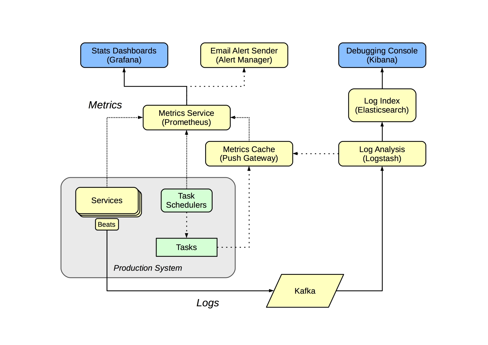

# The UK Web Archive

## Introduction

The UK Web Archive (UKWA) collects millions of websites each year, preserving them for future generations. You can find out more on our official website: [www.webarchive.org.uk](https://www.webarchive.org.uk/)

This document presents a detailed summary of how the UK Web Archive was run, from my perspective as the leader of the technical team. I was in this role from February 2012 to January 2024, and the initial focus of my work was the successful execution of the first large-scale crawls under the new [Non-Print Legal Deposit Regulations](https://www.legislation.gov.uk/uksi/2013/777/made) immediately after those regulations came into force on the 5th of April 2023. In the years following that, the emphasis shifted to making the system more robust and reliable, keeping up with trends in web technology, and starting to explore how researchers can make use of archived web material.

### Service Delivery Team

The heart of the UK Web Archive is the interdisciplinary cross-organisational [service delivery team](https://www.gov.uk/service-manual/the-team) at the [British Library](https:///www.bl.uk/), working on behalf of all the [UK Legal Deposit Libraries](https://en.wikipedia.org/wiki/Legal_deposit#United_Kingdom), who all contribute funding to its operation. This team is are responsible for both the day-to-day operation of the service, and it's continuous improvement over time.

In contrast to most of the technical staff at the British Library, this is a fixed-resource team: the roles are permanent positions, and each role has a fixed amount of time dedicated to web archiving, which is usually 100%.  This gives us the stability we need to manage operations as well as implement the continuous improvement we need to respond to the changing web.

CURRENT COMPOSITION

The precise composition of the team has, of course, changed over time. But these slower changes are much less disruptive than the rapid switching between services that the project-oriented resource allocation model where different people work on different things from month to month. That model works perfectly well for more established domains, e.g. where the needs and requirements are stable and well understood.  But in more specialised or unusual domains, dedicated teams are needed, who can be trusted to operate autonomously and manage the prioritisation and execution of the work amongst themselves.

During my years at the web archive, perhaps the biggest change was the removal of the dedicated Head of Web Archiving role. The pressures of austerity were ever present, and when Helen Hockx-Yu left that role, the decision was take to merge those responsibilities into other roles.  

The original team was entirely hosted within the IT department of the library, with the group of both curatorial and technical staff reporting to the head of IT. In the new model, the team continued to operate as a single dedicated group, but the curatorial staff and technical staff reported separately into the collections and IT departments respectively. This improved the degree to which the service was integrated within the wider curatorial team, but made the service less visible within the IT department.  The fact that the leadership role was now spread across existing staff also reduced the effort that could be dedicated to internal advocacy, outreach and research projects. 

While this may sound negative, it's important to understand the immense pressure on the British Library during this period. Endless rounds cuts and funding freezes meant many other parts of the library were much more badly affected. As operators of a statutory function, delivering a forward-looking and growing service, our funding has generally been relatively stable.

Of course, while the largely stable funding was welcome, running a service under these circumstances requires a clear understanding across the team of what we're trying to achieve and how work should be prioritised.

### Goals

The core goals of the service can be summarised as follows:

- The UK Web Archive (UKWA) collects millions of websites each year, and have been collecting websites since 2005. We do this for posterity, but also for readers and researchers today.
- We enable curators and collaborators to define what we should collect, and how often. We attempt to visit every UK website at least once a year, and for the sites the curators have identified we can visit much more frequently. For example, we collect news sites at least once per day.
- We capture the websites using web crawling software, and copying the live sites into static records we can preserve for the future.
- We use these records to reconstruct an imperfect facsimile of the original live sites, allowing our readers and researchers to browse the UK web as it was in the past. We can also analyse these historical records as data, to extract historical trends, or to build access tools.

To dig a little deeper, we also tried to express what our users need in the form of simple use cases.

### Use Cases

For our Readers, we want them to be able to:

- **View** archive web pages as the were in the past, if they know what URL they are interested in.
- **Browse** curated collections of archived web pages and sites.
- **Search** for web pages to find what they need.
- **Analyse** our archived web pages, exploring the collection as a dataset.

To meet these needs, we need to populate the archive. To do this, our _Archivists_ and _Curators_ need to:

- **Collect** live web pages, by directing our web crawlers to capture them on various frequencies.
- **View** what the archived web pages the crawler collected, to check how well it's working.
- **Describe** the archived web pages and sites, to help document today's web and make it easier for _Readers_ to find.

### Priorities

When there is so much to be done, and especially dealing with unexpected and urgent issues, it is important that we all understand the overall priorities of the different types of work we undertake.

Generally, operational issues take precedence over continuous improvement. Within that overall framework, our services are prioritised as follows:

1. __Crawling:__ We cannot preserve what we fail to capture in the first place. Ensuring our regular and domain crawls are running as expected is our highest priority end-user service.
   - Frequent Crawls
   - Domain Crawl (if running)
   - Supporting services like Gluster.
   - Automation platform, and automated tasks like launches, tidying, etc.
   - Monitoring
2. __Long-Term Storage:__ Crawled material needs to be transferred to HDFS promptly for safe keeping.
   - HDFS itself and capacity management.
   - Operation and monitoring of HDFS and `move-to-hdfs` processes.
   - Backup of live service databases to HDFS.
   - Replication of HDFS to a separate location (NLS).
   - TrackDB (which is used to track indexing status etc.) ???
3. __Ingest Services:__ So curators, archivists and parters can define what gets crawled and how it's described.
   - W3ACT
   - QA Wayback
   - Document Harvester
4. __Access Services:__ So readers and researchers can access and use our collections.
   - The website
   - Public Wayback
   - Full-text Search
5. __Improving Crawl Quality:__ Areas for improvement include:
   - Improved automation
   - Improved reporting 
   - Automated verification & QA
6. __Improving Ingest Services:__ Areas for improvement include:
   - W3ACT fixes and features
   - Document Harvester improvements
   - Integrated reporting and analysis
7. __Improving Access Services:__ Areas for improvement include:
   - New website features
   - Updated version of Wayback
   - APIs and datasets

This is a service-oriented perspective. Of course, each service area has its own underlying infrastructure, like servers and networks.

### Guiding Principles

One area I'd like to have had time to work on with the UK Web Archive and wider British Library teams is the wider principles that guide our work.

I've long been particularly fond of [Ranganathan's _Five Laws of Library Science_](https://en.wikipedia.org/wiki/Five_laws_of_library_science):

- Books are for use.
- Every person his or her book.
- Every book its reader.
- Save the time of the reader.
- A library is a growing organism.

Then there's the [British Library Values](https://web.archive.org/web/20230129044617/https://www.bl.uk/careers/what-we-do/vision-and-values):

- Put users at the heart of everything we do.
- Listen, innovate and adapt to a changing world.
- Treat everyone with respect and compassion.
- Embrace equality, fairness and diversity.
- Act with openness and honesty.
- Collaborate to do more than we could by ourselves.

Between them, I think that over the years these broad statements have provided some reassurance that the whole service team is heading in the right direction.

#### Open Source Collaboration

In particular, one thing I've tried to bring to the team is a focus on open collaboration with international partners through shared open source tools. Many web archives operate under specific and unique practical and legal constraints, and web archiving itself is still a fairly niche concern. All of this makes it very difficult rely on commercial services and tools, as this nascent market lacks the consistency of requirements across customers needed to assure the economy of scale that is a pre-requisite for a commercially-viable profit margin.

As we're effectively forced to build our own things, it makes sense to try to share the burden of developing these tools across institutions. The [International Internet Preservation Consortium (IIPC)](https://netpreserve.org) has be a crucial conduit in this regard, and has helped the wider community find way to collaborate together.

Where appropriate, I've tried to ensure the UK Web Archive helps support the funding and development of open source tools, either through direct contribution of time and effort, or by project funding or commercial support contracts. As well as developing the tools we need, this work also aimed to help others get started creating and hosting their own web archives.  A national-scale web archive is not the right solution for every case, and if we can grow the community of practice around the tools, everyone will benefit.

## Technical Architecture

To get an idea of the overall technical architecture, we won't start with an attempt to enumerate every component involved. First, we'll break it down as a set of larger technical areas, using the names we tend to use when discussing them.

### High-level Architecture

The web archive is composed of a number of distinct groups of services, with clear data standards and APIs between them. This allows each group of services to evolve independently of the others.

Here we present them as a [Wardley map](https://learnwardleymapping.com/home/introduction/), starting with users and the required user capabilities at the top, and moving down the chain of services that fulfil those needs. The horizontal position of each service group gives a rough indication of the maturity and degree of UKWA-specific customisation involved for each group of services.

```{figure} maps/ukwa-arch-overview-Overview.svg
---
width: 100%
align: center
name: ukwa-arch-overview
---
A high-level [Wardley map](https://learnwardleymapping.com/home/introduction/) of the main UK services.
```

The dotted lines indicated data standards that connect services via regular updates, and the solid lines indicated live API connections. For example, the crawl services can proceed even if all other services are offline, but need to recieve updated crawl job specifications in order to change what and how we crawl web sites. In contrast, if our storage service is not available, all services that depend on viewing stored data will also break.

Management and Monitoring services are not directly connected to the overall WARC lifecycle, but orchestrate and verify all activities via their external interfaces.

### Information Flows

The _ingest_ information flow, for _Archivists_ and _Curators_, is as follows:

1. The _Archivists_ and _Curators_ use the _Ingest Services_ to configure the crawl parameters that say which sites to crawl, when, and how.
2. The Frequent Crawl system takes the crawl definitions from the _Ingest Services_ and attempts to crawl the specified sites.
3. The Domain Crawl runs once a year and attempts to crawl all UK sites.
4. Both crawler services capture the results as [WARC](https://iipc.github.io/warc-specifications/specifications/warc-format/warc-1.1/) files and log files which are tranferred to our [Hadoop](https://en.wikipedia.org/wiki/Apache_Hadoop) cluster.
5. Indexing tasks run over those WARC files, creating indexes that allow us to find archived URLs.
6. The _Ingest Services_ make all web pages available for inspection via a dedicated playback service known as _QA Wayback_ (using the indexes and the WARC files to replay the archived web pages).
7. The _Curators_ add or update the metadata that describes the content that has been collected. This includes license agreements with website owners to facilitate capture and/or open access to the archived material.

For _Readers_, the overall _access_ flow is:

1. Our _Readers_ come to the _Website_, either directly or via links or metadata in other discovery systems.
2. They can lookup URLs of interest, and play them back via the _Wayback Service_. Note that in library reading rooms they will have full access to the content, whereas the public _Website_ only gives access suitably-licensed material.
3. They can browse the collections of archived pages via the _'Topics & Themes'_ section of the _Website_.
4. They can use full-text faceted search to find URLs of interest based on their content.
5. They can use trend analysis or download datasets in order to understand and analyse the archived web pages.

### Components, Customisation & Maturity

As indicated by the position of the services on the diagram above, the Hadoop cluster is entirely generic, and the WARC files are specific to web archiving, but generic across web archives.

The Wayback service and the indexes are also fairly generic across web archives, although not quite as widely used as the WARC format.

The crawl systems are based on the Internet Archive's [Heritrix3](https://github.com/internetarchive/heritrix3) crawler, but a number of additional modules added to support our specific needs and remit.

The end-user systems are the most heavily custom-built components, with the website itself being the most recent and least mature.

### Development & Deployment

...

The individual components are deployed so that _access_, _ingest_ and _management_ services all run independently.

...

## Ingest Services


### W3ACT

Our curators work with our [W3ACT](https://github.com/ukwa/w3act) (World Wide Web Annotation and Curation Tool), which provide a user interface for:

- Configuring the crawls, including honouring our Non-Print Legal Deposit constraints on crawl scope. 
- A license workflow to ask site owners for an appropriate license to permit us to crawl (if not in scope for Legal Deposit) and for open access (if the site is not already suitable licensed).
- Collecting metadata describing the targeted sites.
- Collecting metadata describing book or journal publications found by the crawl (also known as the Document Harvester) to be submitted to the library's main catalogue systems.

Currently, user accounts in W3ACT are managed separately from any other user account system. It is particularly important to know if users are from a Legal Deposit Library or not, as staff of those organisations are able to review NPLD material.

Some configuration is sensitive, like whether to allow the crawler to ignore robots.txt, so there are different user roles, some of which have more control than others.

### Crawl Feed API

To drive the crawl, we generate lists of crawl jobs to be executed, which look like this:

```
[
    {
        "title": "gov.uk Publications",
        "seeds": [
            "https://www.gov.uk/government/publications"
        ],
        "schedules": [
            {
                "startDate": 1438246800000,
                "frequency": "MONTHLY",
                "endDate": null
            }
        ],
        "ignoreRobotsTxt": false,
        "depth": "DEEP",
        "scope": "root",
        "watched": false,
        "loginPageUrl": null,
        "secretId": null,
        "documentUrlScheme": null,
        "logoutUrl": null,
        "id": 1
    },
    ...
 ```

Crucially, while W3ACT implements a lot of processes specific to the UK Web Archive, the crawler system only needs the data in the crawl feed. Although the configuration options do reflect expectations of the capabilities of the crawler itself, the use of this simple data format interface means that the two components can deployed and updated independently.

### The Frequent Crawler

The 'frequent crawler' implements the curated crawl jobs, and depends only on the crawl job specification shown above. A set of Python scripts are used to manage a set of crawl jobs configured to this specification. The crawling process results in a set of WARC files that capture the data and logs that capture some details about what we did and didn't crawl (e.g. blocked by robots.txt, or by a crawl quota).

#### Evolution in Crawler Technology


### The Domain Crawler

The annual domain crawl is operated separately, and launched separately using lists of known URLs from various sources (including W3ACT records marked 'Domain Crawl Only').  If outputs WARCs and logs in just the same way as the Frequent Crawler.

### The Document Harvester

This additional post-processed step scans the log of what was crawled and looks for things that appear to be publications on sites that W3ACT users have indicated should be scanned for documents.  This post-processor checks the items are available for viewing and sends records to W3ACT for all the documents.  The users then use W3ACT to check the metadata and submit it to downstream British Library systems. The metadata entry system uses pdftohtmlEX to present the PDF to the user while allowing them to select text from the PDF to quickly populate the metadata form.

### W3ACT QA Access


## Access Services

Combining the WARCs and logs with metadata from curators, we offer various types of access.

### Playback

The primary access mode is via a Playback service. This relies on readers knowing which URLs they wish to access, and a Content Index (or CDX) service is used to look up which WARC records hold copies of each URL, and from what times.

### Browse & Search

We take a range of steps to provide useful access to our collections for users who do not know which specific URLs they need. We use W3ACT to gather archived material into a set of browsable collections, and create a full-text index so the contents of the archive can be searched. This index can also be used to explore trends and perform some basic analyses.

### Datasets, Statistical Reports & APIs

We also work with researchers to provide data sets that summarise some factual aspects of the archived resources. For example, in the past we have processed our WARCs to analyse links between web sites, and how they change over time. The same infrastructure can be used to generate statistical reports.

Where appropriate, we also offer API access to information that it better queried than downloaded. For example our Playback service offers the Memento API, which allows others to query our holdings without downloading some massive dataset.


## Management Services

### Preserve

We keep the WARCs and log files from all the crawlers, in a folder structure that reflects the crawl process. We keep content obtained under different terms in separate folders. For example, openly available Non-Print Legal Deposit material is separate from material that we obtained by permission, or from behind a paywall.

### Automation & Orchestration

#### Evolution of Automation Systems


## Management

### Maintaining service through system migrations

A common use case is wanting to be able to maintain access to a service while upgrading or replacing it.  This document covers some suggestions of how to do this, based on our experience running UKWA.

#### Sync & Switch

The idea here is to run a new service in parallel to the old one, but to rapidly synchronise the data so while the older service 'leads' the new one is following close behind. Because the two are synchronised, it is possible to _briefly_ pause any clients and update them to refer to the new service.

A good example of this is internal CDX service, which runs on OutbackCDX, which is used to enable playback of web pages and so is a critical part of our service. But upgrades can be slow because of the large amount of data in it. Fortunately, the on-disk format of the system's database is a fairly simple set of files that are created and appended by the service, but not otherwise modified or edited. Better still, the design of OutbackCDX means that these files could be updated while the system was running, and as long as there's only one process updating the database, it works fine. This means we were able to use `rsync` to keep updating the data from the older service and make it available in the newer service, and run _read only_ checks on the newer service to check it was working.

The final switch-over process looked like this:

- Block/shutdown all clients that write to the (old) CDX service.
- Run one final `rsync` and check it worked.
- Switch read-only clients over to the new service. Check they are working okay.
- Switch write clienrs over to the new service. Check they are working okay.
- Decommission the old service.

Because most of the data had already been transferred over in previous synchronisations, the final data synchronisation is nice and quick. This means the eventual service downtime is only a few minutes, and if anything goes wrong, it's always possible to revert to the old system.

#### Access Facade

For services where synchronisation is slow or risky, we can manage migration using a more sophisticated approach:

1. Separate the  _write_ and _read_ functionality so that they can be operated independently.
2. Implement the _read_ functionality so the _read_ service can pull data from more than one _write_ service.

The reason for treating _write_ and _read_ functionality differently is partially because writes are usually easier to _pause_ than reads. But mostly because _ensuring consistenty of data in multi-component systems is really really hard!_. There's even a [theorem](https://en.wikipedia.org/wiki/CAP_theorem) that proves precisely how hard it is!

#### Fast Switching

Service aliases and proxies.


### Procedures 

... TBC ...

## Monitoring Services

We need to monitor services to raise alerts when things go wrong, to collect and track statistics on behaviour, and to allow us to debug issues when they arise. In the past, our services have been few in number, and deployed on only a few machines, and much of this has been handled using traditional tools which are not well-suited to highly 'elastic' containerised or cloud-oriented systems. ([This presentation](https://www.youtube.com/watch?v=hCBGyLRJ1qo) explores some of these issues.)

As our container-oriented crawl system is likely to contain large numbers of separate services, we need to move to a scalable approach to monitoring, based on tracking critical metrics. As elsewhere, we prefer to configure and use well-established best-of-breed open source applications to handle these kind of infrastructural issues, and attempt to minimise the amount of custom code we need.

### Overall Monitoring Approach



The monitoring system handles two classes information - metrics and logs. The metrics are used to generate alerts and statistics, and the logs are cached so we can debug problems.

### Alerts & Statistics

The metric monitoring system is focussed on exposing metrics that can be used to check the health of the system. For long-running services, this means ensuring those services are up and they are responding in a timely fashion. Batch jobs and tasks can't be queried in this way, so instead are modified to update suitable metrics upon completion, and the monitoring system checks those metrics are being updated as expected.

We use the [Prometheus](https://prometheus.io/) metrics service to record and track these metrics, and [Grafana](https://grafana.com/) to provide a sutiable service summary screen. We can add [alert rules](https://prometheus.io/docs/alerting/rules/) to watch out for problems, and Prometheus will notify us via the [alert manager](https://prometheus.io/docs/alerting/alertmanager/) component.

We use Prometheus's ['blackbox exporter'](https://github.com/prometheus/blackbox_exporter) to monitor our groups of HTTP services, and there are a large number of other [exporters and integrations](https://prometheus.io/docs/instrumenting/exporters/) we use to monitor common software applications.

Services that are specific to us require additional ['exporters'](https://prometheus.io/docs/instrumenting/writing_exporters/) or [instrumentation](https://prometheus.io/docs/instrumenting/clientlibs/) to make the metrics available, but these are few in number and mostly just require us to re-factor our existing monitoring code.

For batch tasks, each should post suitable metrics to the [Push Gateway](https://prometheus.io/docs/instrumenting/pushing/) when completed, and the metric dashboard and alerts should be configured to monitor that the task has executed successfully within the expected time-frame.

For example, when we back-up the W3ACT database, [once the task chain complete successfully](http://luigi.readthedocs.io/en/stable/tasks.html#events-and-callbacks), we post a timestamp and the size of the backup (in bytes) as metrics via the Push Gateway. These are polled by Prometheus, from where we can use Grafana to check that a backup has occurred in the last X hours, and that the new backup is of the expected size (roughly the same or larger than the previous backup). Raising alerts in this way, based on tests of expected outcomes, is much more robust than expecting that we will always be reliably alerted when a task fails to run.

Areas to monitor:

- Check HTTP-based services are up and responsive (in groups)
- Check HDFS storage status and increase. (requires a custom 'exporter' to scrape HTML tags)
- Check Crawler status (requires a custom 'exporter' scanning Heritrix instances and summarising metrics)
- Check Crawler local disk space etc.
- Check AMQP/Kafka queues.


### Log Indexing & Debugging Console

Service logs and other events (like crawl events) routed from servers e.g. using `filebeat` to send logs to a Kafka service from which `logstash` can consume events and then push the results to `elasticsearch`. This data can be inspected via [Kibana](https://www.elastic.co/products/kibana), which acts as a 'debugging console' that be used to work our what's happening. Using Kafka as the transport makes it possible for all such logging processes to be done in a consistent manner without them being tightly-coupled.

In contrast to the alerting & statistics system, only the recent logs are kept here, although some useful metrics may be extracted from the logs and passed to the metrics service for tracking. Any 'formal' reporting should be implemented as ingest or access tasks rather than done here.

Debugging of specific batch tasks should be possible via the Luigi Scheduler interfaces. In this case, the goal of the monitoring layer is to route you to the correct Luigi Scheduler and task result.

For problems with long-running services, the goal is to summarise recent activity and direct you to the problematic system or systems.


## Timeline

- Start job
- NPLD regs
- Restructure
- GLAM Workbench
- Award
- COVID
- End job

