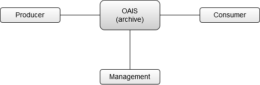

# Contexts & Environments

What kinds of environments do archives operate in? How does this affect the way things work, and the communities the archive works with?

## The OAIS Environment

The [Open Archival Information System (OAIS)][1] presents a simple model for the environment an archive operates in:

## Kinds of Environment

Audiences, internal archive, enchanced care of the same to the same audence. e.g. BBC Archive.

See {doc}`/asides/spacetime-plots/index` for examples.

...

### Direct 

Crucially, this means the DIP is generated from the AIP...

Pipeline versus sidecar preservation

POINT: If your not generating your DIP from your actual AIP you’re not doing OAIS.

Use digitised images as example. Look at risks of the sidecar approach. 

### Backup (via the publisher)

### Failover (via the published record)

[1]: (https://public.ccsds.org/pubs/650x0m2.pdf) 

