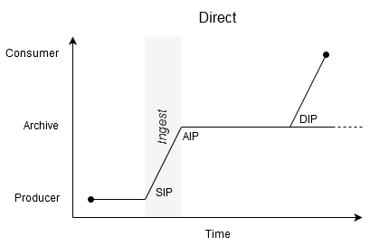
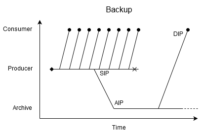

<!-- #region -->
# Environments & Communities

One of the biggest reasons different organisations need different tactics is that they are actually trying to accomplish very different things. They operate in very different environments, work with very different communities, and consequently have very different goals.

These relationships, and their consequences, are often complex and multifaceted. To help navigate this situation, we propose a basic set of idealised patterns that can help cleave apart the different risks and goals in a given situation. This is followed by some examples, showing how these patterns appear and combine in different situations.


## Environments & Meaning

We start with the simple, abstract model presented by the [Open Archival Information System (OAIS)][^oais]:

```{image} _oais_environment.svg
:width: 70%
:align: center
```

OAIS deliberately captures the relationships at a high level, so that it remains generally applicable across contexts. This approach shifts the question of relationships to the definition of the _Designated Community_ the archive serves, which acts as a nebulous _other_ to the archive's _us_. This makes the concept difficult to work with in practice.[^designated-com-prob-blog]

[^designated-com-prob-blog]: See, for example, [this 2023 blog post "_Designated communities - a disconnect between theory and practice?"_](https://www.dpconline.org/blog/designated-communities-applying-the-theory-in-practice)

Rather than taking that path, but working within the same overall framework, it can be helpful to consider the possible relationships between the archive and _Management_, it's _Producers_ and _Consumers_, and the wider organisation the archive belongs to. For example, do the _Producers_ and _Consumers_ belong to the same organisation as the archive and it's _Management_? 

This matters because we need to know who, of all those people, gets to decide what these digital resources _mean_?
<!-- #endregion -->

## Environment 1: The Archive

The first case to consider is where, in essence, our users _are us_. Where those producing the digital records are also those consuming them, and where everyone operates under the same management structure. Where the repository is the long-term memory of the organisation to which it belongs.

```{image} images/_oais_environment_a.svg
:width: 70%
:align: center
```

We refer to this pattern as the archetypal _Archive_. This naming convention is perhaps not ideal as _Archive_ is a bit of a overloaded term, but this pattern is perhaps the closest to a strict interpretation of an _Archive_, in the sense of formal record keeping practices.

Whether or not you recognise the terminology, the crucial thing that defines this pattern is that _these are your records!_ Their meaning and purpose is defined by the people in your organisation. Your _Producers_ are your colleagues, and you all share the same overall _Management_, if you track far enough up the overall organisational structure.

In some ways, this makes things simpler. The context you share means the barriers to communication are potentially lower, at least in the medium term. Of course, knowledge management and loss due to things like staff turnover is a significant challenge, but this is true for every organisation, and the archive can be a part of that mitigation.

But if our digital records become inaccessible, perhaps through format obsolescence, or because the definitions in our digital models become confused and disconnected from the context, we have failed. An _Archive_ that cannot find and use it's own records cannot need it's users needs, cannot comply with legal requests, and as such puts itself and the wider organisation at risk.

When you are an _Archive_, you are responsible for judging the value and meaning of your records, and maintaining this over time, for as long as is required. Just keeping the bits and bytes in a big box is unacceptable -- you must know how to interpret them for access, both in terms of software for playback/rendering, and in terms of the meaning of the records.

Some discussions of digital preservation assert that _this should always be the case_: that it's _always_ our responsibility to both store _and interpret_ our collections. But this is not the case. We cannot provide the canonical interpretation of a digital resource if we are not the masters of it's meaning. Which brings us to our second pattern.

<!-- #region -->
## Environment 2: The Library

In this archetypal framework, the opposite of an _Archive_ can be described as a _Library_.

```{image} images/_oais_environment_l.svg
:width: 70%
:align: center
```

Here, the OAIS archive is a distinct organisation, holding the records of others.  The publishers and consumers are your audience, not your colleagues. While a _Library_ can _of course_ choose to interpret the works it holds, it cannot be the final arbiter of meaning, any more than it is the responsibility of the Louvre to exactly why the Mona Lisa is smiling like that.[^muse-lib]

[^muse-lib]: Yes, a museum like a _Library_ of _Things_ in this model :grimace:. Look, it's just a framing device to separate authorities from communities, alright? Bear with...

Libraries are _usually_ expected to act as [common carriers](https://en.wikipedia.org/wiki/Common_carrier), connecting books and their readers without passing judgement. The _Consumers_ are expected to interpret works, perhaps with some context and analysis from experts, but even here the library is supposed to remain neutral. 

Of course, in truth, this trope of objectivity is flawed, as libraries exert judgement over works all the time, through their selection and retention criteria, and how works are curated and present. This can be immensely difficult and political due to things like sensitive or illegal content, all of which is far too complex to be covered here.[^not-me] Instead, we focus on how this _Environment_ affects how we approach the _digital preservation_ of these items, honouring the judgement of the content for selection/retention which we assume has already taken place. 

[^not-me]: And there are far better people than me to cover it!

The distinguishing feature of digital resources is the software needed to access them, and the hardware and network dependencies that implies. If we get that wrong, then the thing we show our _Consumers_ may be misleading, reflecting our flaws rather than the _Producers_ intent.

The problem is, because they're not _ours_, it's hard to tell the difference.

Digital resources have two layers of interpretation, which we can refer to as the medium and the content. Books are a medium, but the reader does not need anything extra in order to read it.[^print-context]

[^print-context]: Just light to read by. And a dry place to be. And maybe somewhere to sit. Oh, and a breathable atmosphere and stable physical environment. And either a sealed, pressurised space vessel or a planet with a gravitational constant of around 1G. And a nice cup of tea, if it's no bother? Thanks. Lovely.

----

Something somethings really well-defined formats _in principle_ make the digital-level-meaning canonical, but in practice digital documents are not like CDs.


For digital preservation, this means the primary role of the library is to pass on what it's got, i.e. binary preservation is acceptable.  Archives are expected to maintain the meaning of the records, so have the authority to sign off on migrations.

This seems to be linked to the formats.  There are formats that are well-standardised, so we can say we can attempt to migrate or emulate without affecting the meaning because the layer we are operating at is well-known. Libraries still have no sign-off capability.  But for unusual formats, defined by the Producer (only? also chosen by?), we cannot meaningfully determine software interpretation, so cannot migrate/emulate?

_Not quite getting to the core point of understanding when binary-only is the right approach._

Role of validation, Postel's Wedge. Pipe or Producer. 


```{image} images/_oais_environment_sa.svg
:width: 70%
:align: center
```

Open Archives and Libraries have a much wider audience, which brings additional challenges.


```{image} images/_oais_environment_pl.svg
:width: 70%
:align: center
```

<!-- #endregion -->

## Kinds of Environment

Audiences, internal archive, enchanced care of the same to the same audence. e.g. BBC Archive.


### Direct 



Crucially, this means the DIP is generated from the AIP...

Pipeline versus sidecar preservation

POINT: If your not generating your DIP from your actual AIP you’re not doing OAIS.

Use digitised images as example. Look at risks of the sidecar approach. 


### Backup (via the publisher)



### Failover (via the published record)


test

```{image} images/environments.svg
:width: 50%
:align: center
```


[^oais]: https://public.ccsds.org/pubs/650x0m2.pdf


### NOT Flow 4: The Split [???]


```{glue} flow_sidecar_dot
:doc: ./info_flow.md
```

This is an audience/community/role pattern not a flow pattern.

#### The Preservation System

... Also a wider pattern the flow...


## Engagement

Approaches to community and patterns of engagement.

Twist of tooling towards distancing users. 

Have you ever been frustrated at not being able to talk to a person?

Look at item pages from lots of instiutions, where's the Reference Desk?

## Surveillance Capitalism

Separate page?

"Monitoring Designated Community"

...
To successfully maintain access to digital resources, all the stakeholders involved need to be in a position to make informed decisions.


i.e. Patterns are

- Surveillance. Watching.
- Broadcast. Speaking, not listening.
- Engagement. one-to-one, still not listening.
- Discourse? Listening.

TO ADD

https://www.dpconline.org/news/twgn-designated-community-gen
