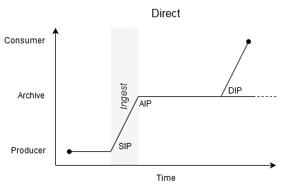

# Environments & Communities

One of the biggest reasons different organisations need different tactics is that they are actually trying to accomplish very different things. They operate in very different environments, work with very different communities, and consequently have very different goals.

What kinds of environments do archives operate in? How does this affect the way things work, the communities the archive works with, and what we should preserve?

_THIS is feeling a bit too broad/non-digital so need to justify it's inclusion._

## Authorities & Audiences

There are three crucial roles here:

- Producer: Who knows or decides what these digital resource mean?
- Archive: Who gets to decide which digital resources get preserved, and how?
- Consumer: Who can access the preserved digital resources?

The types on archival environment differ considerable based on whether or not the people who hold these roles are all members of the archival institution.

This uses Library and Archive in very idealised ways, which might be problematic.

- Archive: Producers and Consumers are members of the same organisation as the Archive.
- Open Archive: The Producers are in the same organisation as the Archive, but Consumers are not.
- Private Library: The Producers are not part of the archival organisation, but the Consumers are.
- Library: Neither the Producers nor the Consumers are part of the archival organisation.

The Archive only gets to independently determine the canonical interpretation if they Producers are part of the same larger organisation. Libraries cannot determine the canonical interpretation. They can request advice at most.

Open Archives and Libraries have a much wider audience, which brings additional challenges.

Libraries are expected to not interpret, but this is in some conflict with selection. Libraries are expected to act as common carriers. Consumers are expected to interpret.

For digital preservation, this means the primary role of the library is to pass on what it's got, i.e. binary preservation is acceptable.  Archives are expected to maintain the meaning of the records, so have the authority to sign off on migrations.

This seems to be linked to the formats.  There are formats that are well-standardised, so we can say we can attempt to migrate or emulate without affecting the meaning because the layer we are operating at is well-known. Libraries still have no sign-off capability.  But for unusual formats, defined by the Producer (only? also chosen by?), we cannot meaningfully determine software interpretation, so cannot migrate/emulate?

Not quite getting to the core point of understanding when binary-only is the right approach.


## The OAIS Environment

The [Open Archival Information System (OAIS)][^oais] presents a simple model for the environment an archive operates in:

```{image} _oais_environment.svg
```

Note there is no 'AIP' at this level! As far as your communities are concerned, that's an implementation detail.

## Role/Authority? Responsibilities!

Postel's Wedge. Pipe or Producer. 


## Kinds of Environment

Audiences, internal archive, enchanced care of the same to the same audence. e.g. BBC Archive.


### Direct 



Crucially, this means the DIP is generated from the AIP...

Pipeline versus sidecar preservation

POINT: If your not generating your DIP from your actual AIP you’re not doing OAIS.

Use digitised images as example. Look at risks of the sidecar approach. 


### Backup (via the publisher)


### Failover (via the published record)


[^oais]: https://public.ccsds.org/pubs/650x0m2.pdf


### NOT Flow 4: The Split [???]

```{glue:figure} flow_sidecar_dot
:figwidth: 100%
:name: "flow_sidecar_dot"

```

This is an audience/community/role pattern not a flow pattern.

#### The Preservation System

... Also a wider pattern the flow...


## Engagement

Approaches to community and patterns of engagement.

Twist of tooling towards distancing users. 

Have you ever been frustrated at not being able to talk to a person?

Look at item pages from lots of instiutions, where's the Reference Desk?

## Surveillance Capitalism

Separate page?

"Monitoring Designated Community"

...
To successfully maintain access to digital resources, all the stakeholders involved need to be in a position to make informed decisions.


i.e. Patterns are

- Surveillance. Watching.
- Broadcast. Speaking, not listening.
- Engagement. one-to-one, still not listening.
- Discourse? Listening.

